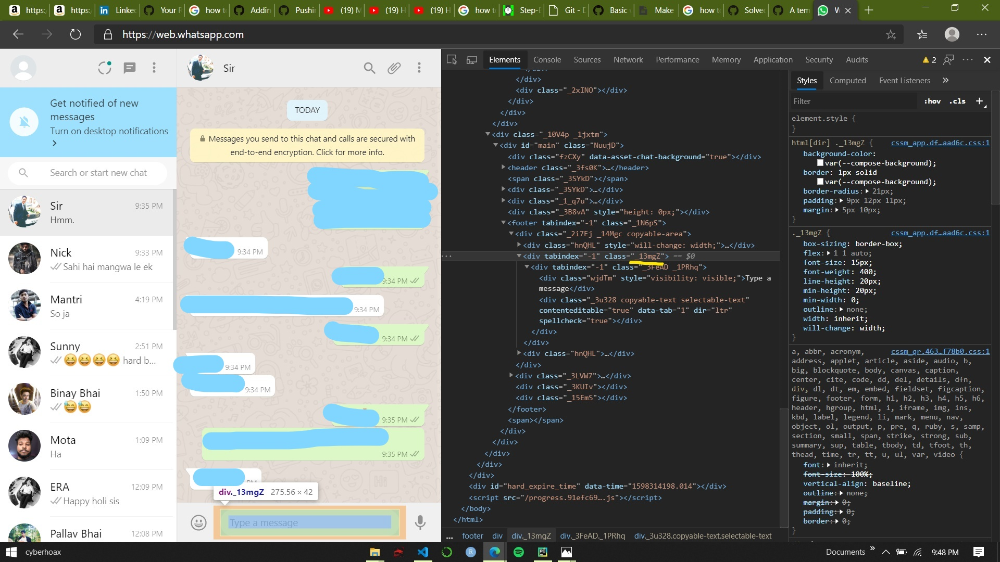
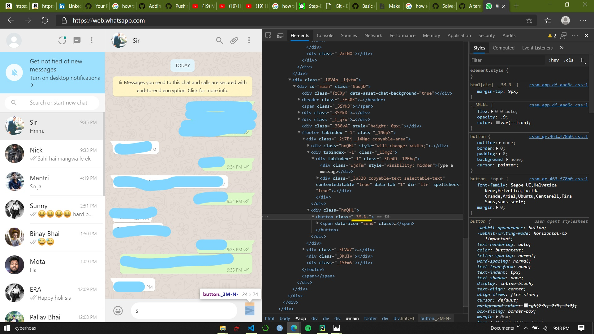
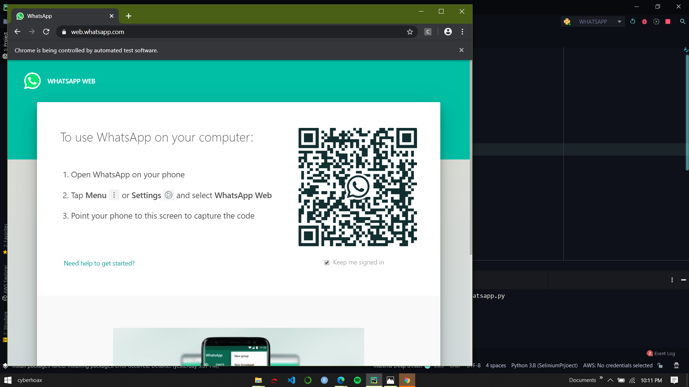
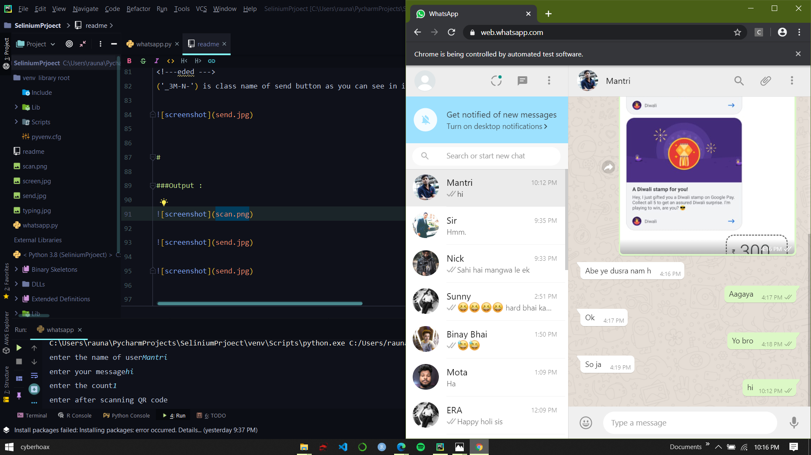

#Project Title
Automate WhatsApp for sending messages to any particular person or group in WhatsApp.

##Getting Started 
It's not totally automated as the QR scan should be scanned manually.
Everythhing is working fine with code as you soon run the code chrome will pop-up
and open WhatsApp web and scan the QR code from your phone. then type contact name in te console box 
and the message you want send and the number of times you wanna send.

--- 
###prerequisites
<!---libraries --->
>Selenium Library

>Chrome driver
#
###installing 


```
#install selenium
python3 -m pip install selenium

#Download and install chromedriver
download [chrome driver here ](https://chromedriver.chromium.org/downloads)
```


#
###code :
```   

# import web driver from selenium 
from selenium import webdriver

# creating an obect to open chrome and set the path inside () of chrome driver 
driver = webdriver.Chrome('/Users/rauna/Downloads/chromedriver')

# passing the WhatsApp url
driver.get('https://web.whatsapp.com/')

# getting data from user
name = input('enter the name of user')
msg = input('enter your message')
count = int(input("enter the count"))
input('enter after scanning QR code')

#saving the defined contact name from your WhatsApp chat in user variable
user = driver.find_element_by_xpath('//span[@title = "{}"]'.format(name))

user.click()

#name of span class of contatct
msg_box = driver.find_element_by_class_name('_13mgZ')

for i in range(count):
    msg_box.send_keys(msg)
    button = driver.find_element_by_class_name('_3M-N-')
    button.click()

```

###snippet from above code:
>user = driver.find_element_by_xpath('//span[@title = "{}"]'.format(name))

>>you can see why [@title = "{}"] because user providing the name of the contact 
>person you wanna send the message
>


#
>msg_box = driver.find_element_by_class_name('_13mgZ')
<!---eded --->
('_13mgZ') is class name of typing box you can see the image below




#
>   button = driver.find_element_by_class_name('_3M-N-')
<!---eded --->
('_3M-N-') is class name of send button as you can see in image below




#

###Output :



###
###


